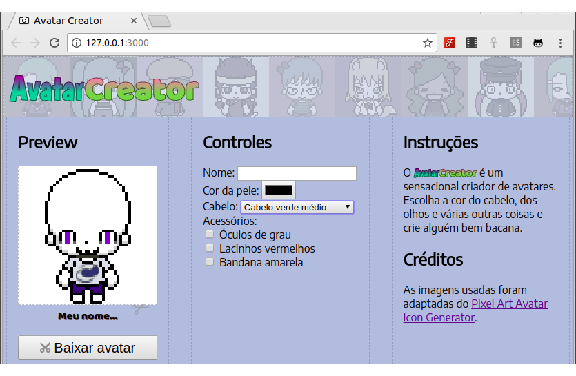
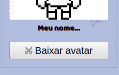
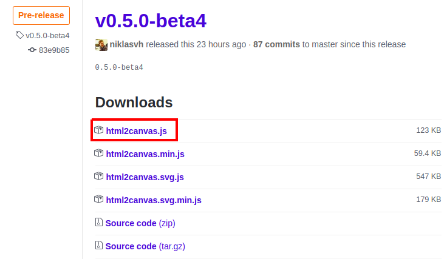

# AvatarCreator



Nesta atividade vamos criar um montador de avatares em pixel art! Nosso
objetivos incluem:

- Exercitar o uso de controles (`input`) do HTML para criar
formulários com os quais o usuário possa interagir
- Detectar quando o usuário interagiu com esses controles
- Usar os valores que o usuário colocou e usá-los de alguma forma
- (Opcional, desafio 2) Usar código JavaScript de uma biblioteca feita
  por outra pessoa

Todos os controles, exceto pelo "botão salvar" (desafio 2) devem ser
colocados por você dentro da section `#secao-controles`.

Todo o código JavaScript, exceto pelo referente ao "botão salvar" (desafio 2)
deve ser colocado dentro de `avatar.js`.

### Exercício 1: nome do avatar

1. Coloque um controle que permita o usuário **digitar** o nome do avatar.
   - Esse controle deve permitir texto de até 50 caracteres.
1. Coloque um evento no controle para que, quando o usuário alterar o campo
   com o nome, a `<p id="avatar-nome">Meu nome...</p>` tenha um conteúdo com
   o valor digitado no campo.

> **Você sabia??**
> Existe o evento `change`, que é chamado em um input quando seu valor é
> "confirmadamente alterado". Em um `<input type="text">`, por exemplo,
> o evento `change` é chamado quando o usuário alterou o valor **e saiu do**
> **controle** (fez ele "perder o foco").

> Existe um evento que é chamado sempre que o usuário interagiu com o controle,
> que é o `input`. Experimente usar os dois eventos para este exercício!

### Exercício 2: cor da pele

1. Coloque um controle que permita o usuário **definir uma cor** para a
   pele do avatar.
1. Coloque um evento, quando o valor da cor for alterado, que vai executar uma
   função que defina a cor de fundo das imagens `#avatar-corpo` e
   `#avatar-cabeca`.

### Exercício 3: cabelo

Há várias imagens com cabelos diferentes que podem ser usados no avatar:

- `imgs/cabelo-careca-curto.png`
- `imgs/cabelo-alaranjado-curto.png`
- `imgs/cabelo-azul-longo.png`
- `imgs/cabelo-cabelo-marrom-curto.png`
- `imgs/cabelo-preto-medio.png`
- `imgs/cabelo-roxo-curto.png`
- `imgs/cabelo-verde-medio.png`


1. Coloque uma lista de seleção (aquela que o usuário clica e ela abre
   mostrando as opções) que permita o usuário **escolher uma opção de cabelo**.
   - Você pode colocar, para cada opção (_i.e._, `<option>...</option>`)
     da lista, um `value` com o caminho da imagem a que ela se refere
1. Coloque um evento, quando a opção escolhida for alterada, que vai
   definir o atributo `src="..."` da imagem `#avatar-cabelo` para o valor
   da opção escolhida

<!-- ### Desafio 1: expressão facial

Há três imagens com expressões faciais (olhos, sobrancelhas, nariz e boca):

- `imgs/expressao-marota.png`
- `imgs/expressao-chatao.png`
- `imgs/expressao-pessoa-invisivel.png`

1. Use controles de "radio" com os quais o usuário pode escolher apenas
   uma opção -->

### Desafio 1: acessórios

Há três acessórios que o avatar pode usar:

- `imgs/acessorio-oculos.png`
- `imgs/acessorio-lacinhos.png`
- `imgs/acessorio-bandana.png`

O jogador pode usar nenhum, todos, ou quaisquer combinação deles ao mesmo
tempo. Sendo assim, determine que tipo de controle é mais adequado para usar.

1. Coloque os controles que permitam o usuário determinar se o avatar **possui
   ou não** cada acessório.
1. Associe eventos a cada um para quando o usuário optar por usar/não usar
   um acessório, o código coloque ou remova a classe `visivel` da imagem
   que representa esse acessório.

### Desafio 2: salvar o avatar (usando uma biblioteca JavaScript)

Crie um botão, abaixo do avatar, que, quando clicado, "baixa a imagem"
do avatar. Exemplo:



> **Você sabia??**
> É possível colocar imagens e até outros
> elementos HTML dentro de um `<button></button>`.

Na verdade, o navegador não nos dá uma forma para fazermos isso usando HTML,
CSS ou JavaScript. Mas existe uma **biblioteca JavaScript** capaz de
nos ajudar chamada **html2canvas**.

Uma biblioteca JavaScript é um arquivo `.js`, como qualquer outro, mas
programado de forma a ser utilizado em outros códigos. Assim, para usar o
html2canvas, basta (a) ir até [sua página (no GitHub)][html2canvas], (b)
baixar o arquivo `html2canvas.js` da versão mais recente e (c) incluí-lo
na página (pode ser abaixo do `avatar.js`).



Agora, é necessário escrever código que usa os recursos oferecidos pela
biblioteca html2canvas. De acordo com sua documentação, ela possui uma função
com o mesmo nome e os seguintes parâmetros:

```js
// no clique de um botão "Baixar imagem"...
html2canvas(elementoQueSeraSalvo, opcoes);
// fim da callback de clique do botão
```

O `elementoQueSeraSalvo` é, como o nome indica, o elemento HTML que queremos
colocar em uma imagem - no caso, o `#avatar-preview`. E `opcoes` é um
objeto que define algumas configurações, das quais precisamos apenas de uma
chamada `onrendered` (_i.e._, em inglês, `assimquedesenhou`:). Devemos
passar, como valor dessa propriedade, uma função que será executada assim
que a biblioteca html2canvas conclua a sua mágica e, dentro dessa função,
precisamos "arrumar uma forma" para baixar a imagem.

A explicação de como isso tudo funciona vai muito além do escopo da
atividade e, por causa disso, o código para chamar a biblioteca, que deve
ser atrelado ao clique de um botão, é o seguinte:

```js
// no clique de um botão "Baixar imagem"...
// 'avatarEl' deve conter o elemento #avatar-preview
html2canvas(avatarEl, {
  onrendered: function(canvas) {
    // a imagem foi gerada nesse objeto "canvas" e vamos pedir a ele
    // uma URL que a representa, codificada em uma String no modelo base64¹
    //
    // ¹base64: é uma forma de representar os pixels da imagem (ou qualquer
    // informação, na verdade) usando uma string com 64 tipos de caracteres
    // (todas as letras, maiúsculas e minúsculas, os algarismos de 0 a 9
    // e os símbolos '/' e '+'). Para mais informações, veja a página
    // da Wikipedia sobre base64 (https://pt.wikipedia.org/wiki/Base64)
    let imagemCodificadaEmURL = canvas.toDataURL();

    // cria um <a href="xxx" download="avatar.png"></a> dinamicamente
    // e o configura para que ele aponte (href) para uma URL que codifica
    // a imagem gerada pela biblioteca html2canvas
    let linkEl = document.createElement('a');
    linkEl.download = 'avatar.png';
    linkEl.href = imagemCodificadaEmURL;

    // coloca esse link no body da página
    document.body.appendChild(linkEl);

    // simula um clique no link
    linkEl.click();
  }
});
// fim da callback de clique do botão
```

## FAQ

### Como atribuir um evento a um elemento?

### Como alternar uma classe?


[html2canvas]: https://github.com/niklasvh/html2canvas/releases
